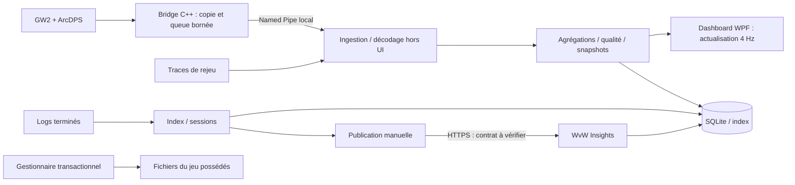

# Architecture recommandée

Statut : proposition à confirmer par un prototype Windows. Pas de benchmark réalisé.

## Comparaison

| Option | Atouts | Coûts / limites |
|---|---|---|
| .NET 10 LTS + WPF/MVVM | Accès direct aux API Windows, UI sans navigateur embarqué, C# pour services et tests, accessibilité et DPI, distribution self-contained | UI Windows uniquement, effort pour une grille de widgets moderne, tests visuels sur Windows |
| Tauri 2 + Rust + TypeScript | UI web flexible, WebView2 partagé, petit paquet possible | Trois domaines avec le bridge C++, frontière IPC supplémentaire, dépendance WebView2 à gérer, coûts mémoire à mesurer |
| Electron + TypeScript | Développement UI et outils de test homogènes, navigateur distribué | Chromium et Node livrés avec l’application, mémoire/taille généralement plus importantes, surface IPC et cadence de correctifs |
| WinUI 3 + .NET | Contrôles Windows récents | Packaging et dépendances Windows App SDK plus complexes ; bénéfice limité pour le dashboard initial |

**Recommandation : .NET 10/WPF** pour cette application spécifiquement Windows, avec calculs hors thread UI. Les performances ne découlent pas automatiquement du framework ; comparer au budget sur une machine réelle. Le modèle et les services restent indépendants de WPF.

## Modules prévus

```text
src/Companion.Domain          Profils, capacités, qualité, définitions métriques
src/Companion.Application     Cas d’usage et interfaces de stockage/transport
src/Companion.Infrastructure  SQLite, fichiers, pipe, HTTP, DPAPI, inventaire
src/Companion.Desktop         WPF, MVVM, navigation, disposition et fenêtres
native/Companion.Bridge       C++ x64, copie callback, queue, transport
tests/Domain.Tests           Métriques, clones, imports, qualité, lots
tests/Infrastructure.Tests   Reprise, fichiers, faux HTTP, accès concurrents
tests/Windows.Tests          DPI, écrans, processus, droits, DLL et pipe
fixtures/                    Traces synthétiques versionnées sans données privées
```

Les dossiers sont un plan, pas des composants déjà implémentés. `Domain` cible .NET standard multiplateforme (`net10.0`) ; `Desktop` cible `net10.0-windows`. Ne pas importer WPF dans le domaine. L’adaptateur Windows reste compilable séparément des tests Linux du cœur.

## Flux



Une seule instance principale détient la base et les opérations sur les addons. Verrou nommé par utilisateur et installation ; une deuxième ouverture active la fenêtre existante. Pas de service Windows permanent en P0. Fermer l’application stoppe ses travailleurs proprement, sans attendre ni bloquer le jeu. Fermer une fenêtre secondaire future ne stoppera pas la collecte.

## Transport local

| Transport | Arbitrage |
|---|---|
| Named Pipe Windows | Recommandé : ACL par utilisateur, pas de port réseau, I/O asynchrones, client C++ et serveur C# simples |
| TCP loopback | Référence BHUD observée ; portable mais découverte de port, authentification locale et risques de collision à gérer |
| Mémoire partagée | Potentiel débit élevé ; synchronisation, versions, sécurité et reprise plus délicates |

Le bridge est client du pipe, l’application serveur ; la connexion et l’écriture ne se produisent jamais dans le callback ArcDPS. Aucun port ouvert sur le LAN. ACL limitée au SID courant, refus des clients distants, longueur maximum des messages ; vérifier l’identité et le PID du client avec les API Windows. Un processus du même utilisateur n’est pas une frontière de sécurité forte : ne pas transformer le pipe en canal de commandes sur le jeu.

## Stockage

`%LOCALAPPDATA%/<nom définitif>/` : base SQLite, sauvegardes, journal des opérations, cache de téléchargement. Profils et jobs transactionnels, migrations versionnées et sauvegarde avant migration. SQLite WAL avec un seul rédacteur. Les logs originaux restent dans leur dossier ; aucune suppression automatique en P0. Conserver des empreintes SHA-256 et des références de chemin, pas des copies intégrales des logs dans la base.

Jetons externes : DPAPI CurrentUser via adaptateur de coffre ; jamais dans les profils, fichiers de diagnostic, traces HTTP ou journaux. Ils peuvent servir à retrouver l’historique, mais on ne les transmet qu’au service concerné. Pas de télémétrie distante par défaut. Prévoir rétention et purge explicites des traces de combat contenant des noms de joueurs.

## Écrans et ressources

P0 : une fenêtre, plusieurs pages et profils. Stocker coordonnées en DIP, taille, état maximisé, identifiant d’écran et DPI. À l’ouverture et lors d’un changement d’affichage, vérifier l’intersection avec les zones de travail, restaurer une taille raisonnable et un bandeau de titre accessible sur l’écran principal. Utiliser la position normale même après maximisation. Tests avec coordonnées négatives, dock, débranchement et 100/150/200 %.

P1 : plusieurs fenêtres rattachées à des pages du même profil, même moteur d’agrégation. Une instance de widget ne possède qu’une position dans une fenêtre ; duplication pour une autre vue. Aucun calcul ou lecteur de pipe dupliqué par fenêtre.

Budgets **proposés**, à mesurer : bridge < 16 Mo de mémoire fixe ; callback p99 < 100 µs ; application < 200 Mo au repos, < 350 Mo en direct ; CPU moyen application < 2 % total sur une machine 8 cœurs de référence ; 4 rafraîchissements UI/s ; latence ingestion→snapshot p95 < 250 ms **hors délai ArcDPS**. Le coût de parsing de logs est séparé, limité à un travail à la fois pendant le jeu. Ces chiffres sont des objectifs, jamais des résultats acquis.
